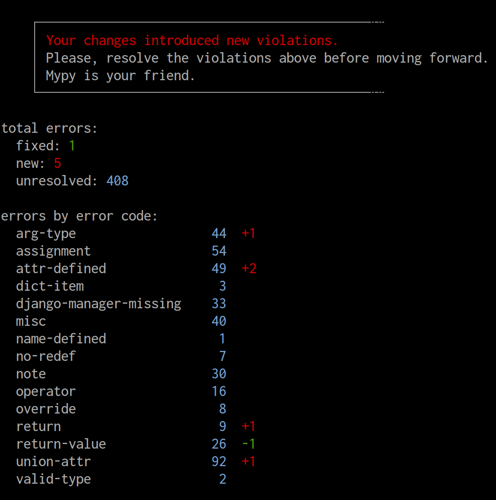
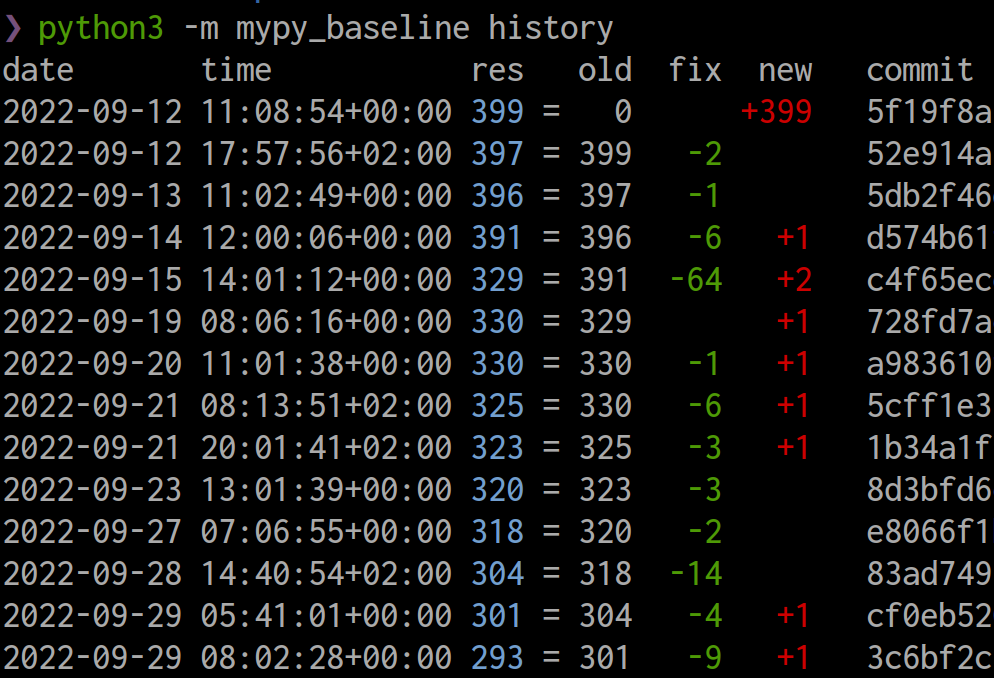

# mypy-baseline

A CLI tool for painless integration of mypy with an existing Python project. When you run it for the first time, it will remember all type errors that you already have in the project (generate "baseline"). All consequentive runs will ignore these errors and report only ones that you introduced after that.

Additionally, the tool will show you what progress you made since the last baseline, to encourage your team to resolve mypy errors:



Features:

+ Battle-tested.
+ Fast and simple.
+ Pure Python.
+ No mypy patching or dirty magic. The tool works exclusively with the stdout of mypy.
+ Nice stats with colors.
+ Can detect exactly what errors were introduced and what errors were resolved, even if they are in the same file.
+ Baseline is carefully crafted to avoid merge conflicts.
+ Baseline is human-readable, and diffs are informative. The reviewers of your PR will know exactly what errors you resolve and what errors you introduced.

## Installation

```bash
python3 -m pip install mypy-baseline
```

## Usage

First of all, make sure mypy includes the error codes in the output. Here is an example (`pyproject.toml`):

```toml
[tool.mypy]
show_error_codes = true
```

Now, you need to create the baseline (it will be stored in `mypy-baseline.txt` by default):

```bash
mypy | mypy-baseline sync
```

After that, you can pipe mypy output into `mypy-baseline filter`, and it will filter out all issues that are already in the baseline:

```bash
mypy | mypy-baseline filter
```

If you introduce new errors, resolve them. If you resolve existing errors, run `mypy-baseline sync` again to re-generate baseline. In both cases, mypy-baseline will tell you what's wrong and what to do. Enjoy the ride!

## Configuration

The tool has a number of CLI flags to configure the behavior of `filter`. The default value for each flag can be specified in `pyproject.toml`. There are all the configuration options and their defaults:

```python
[tool.mypy-baseline]
# --baseline-path: the file where the baseline should be stored
baseline_path = "mypy-baseline.txt"
# --depth: cut path names longer than that many directories deep
depth = 40
# --allow-unsynced: do not fail for unsynced resolved errors
allow_unsynced = False
# --preserve-position: do not remove error position from the baseline
preserve_position = False
# --hide-stats: do not show stats and messages at the end
hide_stats = False
# --no-colors: do not use colors in stats
no_colors = False
```

## History

There are 2 commands to show how the baseline has changed over time:

1. `mypy-baseline history` prints in terminal commits that modified the baseline file and how many lines it had.
1. `mypy-baseline plot` will draw a chart of the baseline size change over time using [plotnine](https://github.com/has2k1/plotnine).



## How to

1. **Integrate mypy-baseline with the project**:
    1. The "Usage" section above covers the basic integration. To summarize, you generate the initial baseline with `mypy | mypy-baseline sync`, and then all consequentice runs of `mypy | mypy-basleine filter` will ignore these errors.
    If you have something like [Taskfile](https://taskfile.dev/) or [Makefile](https://www.gnu.org/software/make/manual/make.html), it's good to provide tasks for both commands, for your team's convenience.
    1. Start with the most friendly and relaxed mypy config. Allow everything that can be allowed. For instance, set `allow_redefinition = true`. That will allow you to focus on the most important errors for now.
    1. `mypy-basleine.txt` should be committed into the repository, so it's always the same and up-to-date for everyone in the team.
    1. Don't forget to integrate it with CI.
    1. And lastly, tell your team about mypy, mypy-baseline, and how to use it. Write some internal documentation, make a tech talk, and support them when they struggle to understand why mypy complaints about something.
1. **Encourage your team to resolve old errors**. The purpose of mypy-baseline not to let you ignore all existing errors in the project, but to let you resolve them gradually, start using mypy right now, and make sure nobody introduces new errors. That's why it's important to bring one day the number of mypy errors to zero. And that should be a team effort.
    1. Foster the engineering culture of making things better. Tell them about [the boy scout rule](https://www.oreilly.com/library/view/97-things-every/9780596809515/ch08.html).
    1. The colorful statistics mypy-baseline shows at the end of each run are designed to encourage people making these numbers smaller. You can help by posting this stats bi-weekly in Slack, so everyone sees the progress you all make.
    1. On review, praise the people who reduced the number of lines in "mypy-baseline.txt".
1. **Resolve new errors**. When mypy-baseline tells you that you introduced new errors and you need to resolve them, have a look at the very top of the command output, above "total errors". There you see the original output of mypy with filtered out old violations. Each error shown there is something you introduced since the last sync. That's what you need to resolve.
    1. Start from going to the named file and line number to see what's the code that caused it.
    1. Read the error message. It says exactly what's wrong.
    1. If you don't understand the error, google it. Chances are you're not the first one to struggle with it.
    1. Use [reveal_type](https://adamj.eu/tech/2021/05/14/python-type-hints-how-to-debug-types-with-reveal-type/) to show the type of a variable. Your IDE may show different types (because it's likely not using mypy for that), so always double-check what exactly mypy sees.
    1. If you still can't figure it out, don't hesitate to ask your co-workers. You all can learn something from it.
    1. The last resort is to add `# type: ignore[error-code]` to the line that caused the issue. Don't overuse it, though, each error reported by mypy is reported for a reason.
1. **Resolve old errors**.
    1. Run bare-bones mypy without using mypy-baseline, and that will spit out all existing type errors.
    1. Run `mypy-baseline top-files`. These are the files that need the most attention. Either they have lots of problems, or there is a small error (like a wrong annotation for a base class method) that causes a cascade of type violations and so fixing it would be a quick win.
    1. Don't forget to run `mypy | mypy-baseline sync` when you finish.
1. **Keep mypy-baseline in sync**.
    1. By default, mypy-baseline will fail if there are resolved but unsynced errors. The reason for that is to keep `mypy-baseline.txt` always up-to-date. If you don't do that, it will be hard for others to see what errors their changes resolved. Think about others.
    1. If mypy-basleine tells you "your changes resolved existing violations", you need to run `mypy | mypy-baseline sync`. It will actualize `mypy-baseline.txt` for you.
1. **Review merge requests**.
    1. Praise merge request author for removing lines from `mypy-baseline.txt`.
    1. Question them for adding new lines in `mypy-baseline.txt`. There should be no new violations. Don't accumulate tech debt without a very good reason. Resolve all type errors right away whenever possible.
    1. Question them adding `# type: ignore`. There (almost) always a way to resolve an error instead of just ignoring it. However, it's not always obvious how. Help them find the way.
    1. If you see some mistakes in type annotations, gently tell tham
1. **Resolve all type errors in the code**. Your ultimate goal is to resolve all errors you have and get rid of mypy-baseline.
    1. As mentioned in "Integrate mypy-baseline with the project", start with the most friendly and relaxed mypy config.
    1. Try adding some third-party plugins, like [django-stubs](https://github.com/typeddjango/django-stubs). Sometimes, they bring the number of detected violations down, not up. If that the case for your project, use it. If not, don't use them just yet, leave it for later.
    1. When you resolve at least 80% of existing errors, make mypy config a bit more strict, and repeat the process. Then make it more strict again.
    1. When you're happy with the config, it's time to integrate mypy-plugins and stubs you haven't integrated yet. See [awesome-python-typing](https://github.com/typeddjango/awesome-python-typing) for what is available.

And whatever happens, be brave. Tinker, experiment, hack, and observe.

## All commands

This is the list of all subcommands mypy-baseline provides:

```plain
filter              Filter out old mypy errors from stdin.
history             Show how the baseline changed over time.
plot                Draw the graph of how the baseline changed over time.
sync                Generate baseline with all existing errors.
top-files           Show files with the most errors.
version             Print the version of mypy-baseline.
```
